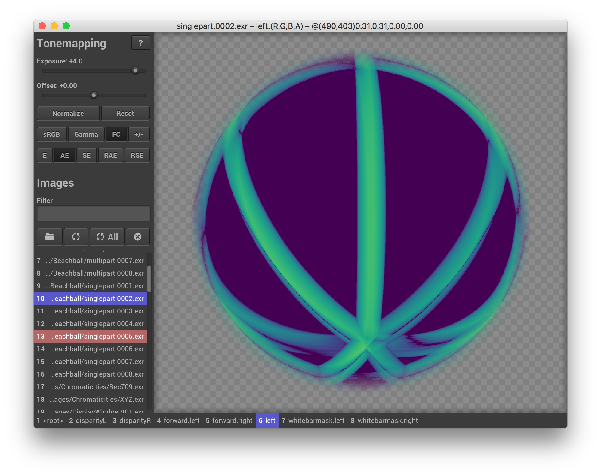

# tev — The EXR Viewer &nbsp;&nbsp; 

Image viewer and comparison tool for graphics people.

- __Lightning fast:__ starts up instantly, loads hundreds of images in seconds.
- __Accurate:__ understands ICC color profiles and HDR. Displays everything in linear sRGB/Rec.709.
- __Versatile:__ supports many [file formats](#file-formats), histograms, pixel-peeping, tonemaps, error metrics, etc.
- __HDR:__ displays true HDR on Apple EDR displays.


_A false-color comparison of two multi-layer OpenEXR images of a beach ball. Image courtesy of [openexr-images](https://github.com/openexr/openexr-images)._

## Installation

Download __tev__ for
- __Windows__: [Installer (.msi)](https://github.com/Tom94/tev/releases/latest/download/tev-installer.msi), [portable executable (.exe)](https://github.com/Tom94/tev/releases/latest/download/tev.exe)
- __Linux__: [AppImage (.appimage)](https://github.com/Tom94/tev/releases/latest/download/tev.appimage) ([how to run AppImages](https://docs.appimage.org/introduction/quickstart.html))
- __macOS__: [Installer (.dmg)](https://github.com/Tom94/tev/releases/latest/download/tev.dmg)

Or install __tev__ via package managers:

#### macOS

```bash
brew install --cask tev
```

#### Arch Linux (Arch User Repository)
```bash
yay -S tev
```

#### NixOS
```nix
# In your inputs
inputs = {
  ...
  tev = { url = "https://github.com/tom94/tev"; type = "git"; submodules = true; };
};

# In your configuration
environment.systemPackages = with pkgs; [
  ...
  inputs.tev.packages.${system}.default
];
```

#### Install from source

Or build and install __tev__ from source. See the [building tev](#building-tev) section below for details. TL;DR:
```sh
$ git clone --recursive https://github.com/Tom94/tev
$ cmake . -B build
$ cmake --build build --config Release -j
$ cmake --install build
```

## Usage

### Graphical User Interface

Images can be opened via a file dialog or by dragging them into __tev__.
They can be reloaded, closed, or filtered at any time, so don't worry about opening more images than exactly needed.

Select an image by left-clicking it, and optionally select a reference image to compare the current selection to by right-clicking.
For convenience, the current selection can be moved with the Up/Down or the 1-9 keys. For a comprehensive list of keyboard shortcuts click the little "?" icon at the top (or press "h") or view [this online visualization](https://keycombiner.com/collecting/collections/shared/f050cc02-f23a-425c-b032-b4c3659c7ef4).

If the interface seems overwhelming, you can hover any controls to view an explanatory tooltip.

### Command Line

__tev__ takes images as positional command-line arguments:
```sh
$ tev foo.exr bar.exr
```

By default, all layers and channels are loaded, but individual layers or channels can also be specified. In the following example, the *depth* layer of *foo.exr* and the *r*, *g*, and *b* channels of *foo.exr* and *bar.exr* are loaded.
```sh
$ tev :depth foo.exr :r,g,b foo.exr bar.exr
```

Other command-line arguments exist (e.g. for starting __tev__ with a pre-set exposure value). For a list of all arguments simply invoke
```sh
$ tev -h
```

### Over the Network

__tev__ can also be controlled remotely over the network using a simple TCP-based protocol.

The `--host` argument specifies the IP and port __tev__ is listening to. By default, __tev__ only accepts connections from localhost (`127.0.0.1:14158`), which is useful, for example, as frontend for a supported renderer like [pbrt version 4](https://github.com/mmp/pbrt-v4).

The following operations exist:

| Operation | Function
| :--- | :----------
| `OpenImage` | Opens an image from a specified path on the machine __tev__ is running on.
| `CreateImage` | Creates a blank image with a specified name, size, and set of channels. If an image with the specified name already exists, it is overwritten.
| `UpdateImage` | Updates the pixels in a rectangular region.
| `CloseImage` | Closes a specified image.
| `ReloadImage` | Reloads an image from a specified path on the machine __tev__ is running on.
| `VectorGraphics` | Draws vector graphics over a specified image.

__tev__'s network protocol is already implemented in the following languages:
- [C++](https://github.com/westlicht/tevclient) by Simon Kallweit
- [Python](src/python/tev.py) by Tomáš Iser
- [Rust](https://crates.io/crates/tev_client) by Karel Peeters


If using these implementations is not an option, it's easy to write your own one. Each packet has the simple form
```
[uint32_t total_length_in_bytes][byte operation_type][byte[] operation_specific_payload]
```
where integers are encoded in little endian.

There are helper functions in [Ipc.cpp](src/Ipc.cpp) (`IpcPacket::set*`) that show exactly how each packet has to be assembled. These functions do not rely on external dependencies, so you can copy and paste them into your project to interface with __tev__.


## Building tev

All that is required for building __tev__ is [CMake](https://cmake.org/) and a C++20-compatible compiler. On Windows, that's Visual Studio 2019 and newer. On Linux and macOS, your system's GCC or Clang compiler is likely sufficient.

Most Linux distributions additionally require _xorg_, _gl_, and _zenity_. On Ubuntu/Debian simply call
```sh
$ apt-get install cmake xorg-dev libglu1-mesa-dev zenity
```

Once all dependencies are installed, begin by cloning this repository and all its submodules using the following command:
```sh
$ git clone --recursive https://github.com/Tom94/tev
```

Then, use [CMake](https://cmake.org/) as follows:
```sh
$ cmake . -B build
$ cmake --build build --config Release -j
```

Afterwards, __tev__ can be installed via
```sh
$ cmake --install build
```
or you can create a standalone installer (Windows, macOS) / [AppImage](https://appimage.org/) (Linux) with
```sh
$ cpack --config build/CPackConfig.cmake
```

## File Formats

- __EXR__ (via [OpenEXR](https://github.com/wjakob/openexr))
- __Ultra HDR JPEG__ (e.g. pictures from newer Android phones; via [libultrahdr](https://github.com/google/libultrahdr))
- __JPEG XL__ (via [libjxl](https://github.com/libjxl/libjxl). Shoutout to [Johnathon Selstad](https://github.com/zalo) for adding support!)
    - Supports both lossy and lossless compression with full HDR capabilities
- __JPEG__ (via [libjpeg-turbo](https://github.com/libjpeg-turbo/libjpeg-turbo))
- __PNG__ (via [libpng](https://github.com/pnggroup/libpng))
- __PFM__ (compatible with [Netbpm](http://www.pauldebevec.com/Research/HDR/PFM/))
- __QOI__ (via [qoi](https://github.com/phoboslab/qoi). Shoutout to [Tiago Chaves](https://github.com/laurelkeys) for adding support!)
- __DDS__ (via [DirectXTex](https://github.com/microsoft/DirectXTex); Windows only. Shoutout to [Craig Kolb](https://github.com/cek) for adding support!)
    - Supports BC1-BC7 compressed formats.
- __WEBP__ (via [libwebp](https://chromium.googlesource.com/webm/libwebp))
- __TIFF__, DNG (via [libtiff](https://gitlab.com/libtiff/libtiff); only some DNG files supported)
- __AVIF__ (via [aom](https://aomedia.googlesource.com/aom)+[libheif](https://github.com/strukturag/libheif))
- __HEIC__ (e.g. pictures from iPhones; via [libde265](https://github.com/strukturag/libde265)+[libheif](https://github.com/strukturag/libheif); disabled in binary release. You must build __tev__ yourself with the `TEV_SUPPORT_HEIC` CMake option. Check patent laws in your jurisdiction before enabling this feature.)
- __HDR__, BMP, GIF, PIC, PNM, PSD, TGA (via [stb_image](https://github.com/wjakob/nanovg/blob/master/src/stb_image.h))

## License

__tev__ is available under the GPLv3 license, which you can find in the `LICENSE.txt` file.
[TL;DR](https://www.tldrlegal.com/license/gnu-general-public-license-v3-gpl-3).

Older versions of __tev__ (v1.30 and earlier) are available under the BSD 3-Clause license.
If required, use git tags to check out these older versions.
